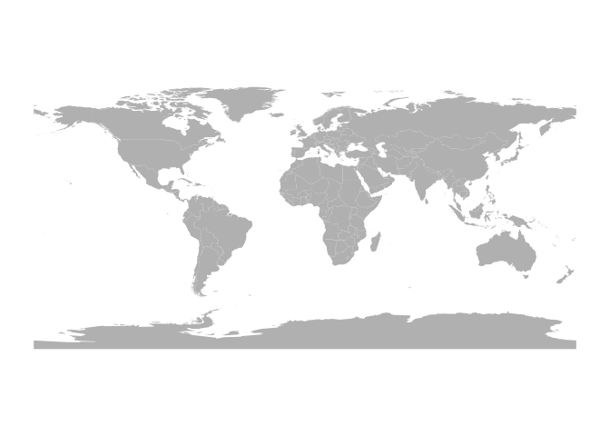
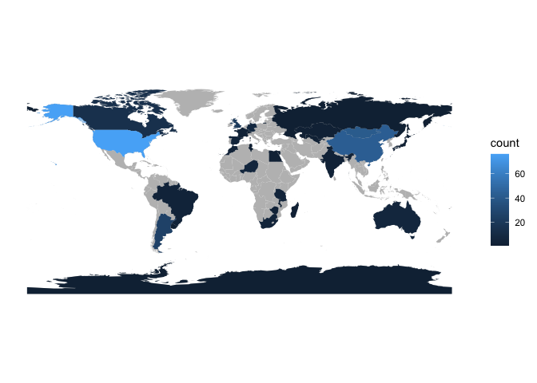
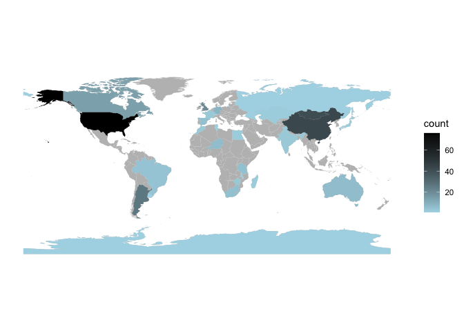
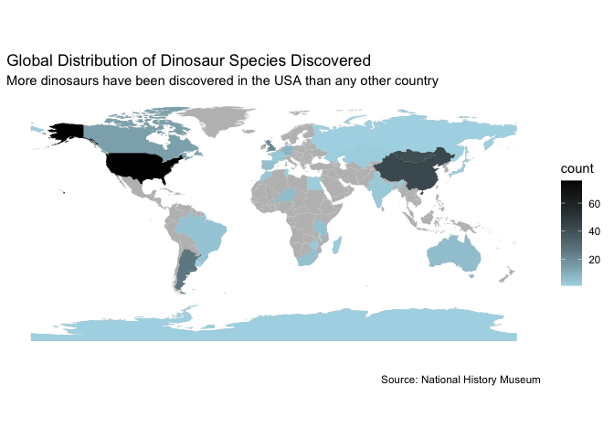

R Notebook
================

This is an [R Markdown](http://rmarkdown.rstudio.com) Notebook. When you
execute code within the notebook, the results appear beneath the code.

Try executing this chunk by clicking the *Run* button within the chunk
or by placing your cursor inside it and pressing *Cmd+Shift+Enter*.

``` r
link="https://github.com/Data-Dumps/deliverable3/raw/main/dinodata_cleaned.xlsx"
  
library(rio)
```

``` r
dinodata=import(link)
#str(dinodata)
DinoTable=table(dinodata$ISO3)
```

``` r
DinoDF=as.data.frame(DinoTable)
names(DinoDF)=c('ISO3','count')
```

``` r
linkMap="https://github.com/EvansDataScience/VAforPM_Spatial/raw/main/worldMap.geojson" 
library(sf)
```

    ## Linking to GEOS 3.10.2, GDAL 3.4.2, PROJ 8.2.1; sf_use_s2() is TRUE

``` r
mapWorld=read_sf(linkMap)

#mapWorld


mapWorld_indexes=merge(mapWorld, #map first
                   DinoDF, 
                   by='ISO3') 


library(ggplot2)
# plot original map
baseMap= ggplot(data=mapWorld) + theme_classic() + 
         geom_sf(fill='gray', 
                 color=NA) # border color
#see
baseMap
```

<!-- -->

``` r
numericMap= baseMap + geom_sf(data=mapWorld_indexes,
                       aes(fill=count), # variable from mapWorld_indexes
                       color=NA)
numericMap
```

<!-- -->

``` r
numericMap2 = numericMap + scale_fill_gradient(low = 'light blue',
                                 high= 'Black')
numericMap2
```

<!-- -->

``` r
titleText='Global Distribution of Dinosaur Species Discovered'
numericMap3 = numericMap2 + labs(title=titleText,x="", caption = "Source: National History Museum", subtitle = "More dinosaurs have been discovered in the USA than any other country")
numericMap3
```

<!-- -->

Add a new chunk by clicking the *Insert Chunk* button on the toolbar or
by pressing *Cmd+Option+I*.

When you save the notebook, an HTML file containing the code and output
will be saved alongside it (click the *Preview* button or press
*Cmd+Shift+K* to preview the HTML file).

The preview shows you a rendered HTML copy of the contents of the
editor. Consequently, unlike *Knit*, *Preview* does not run any R code
chunks. Instead, the output of the chunk when it was last run in the
editor is displayed.
